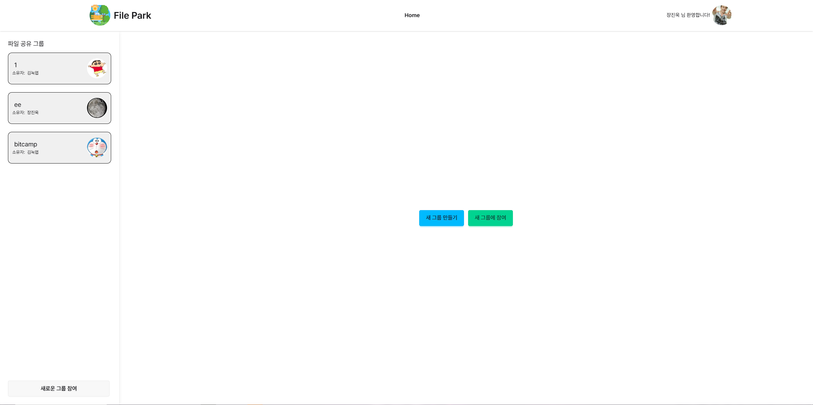
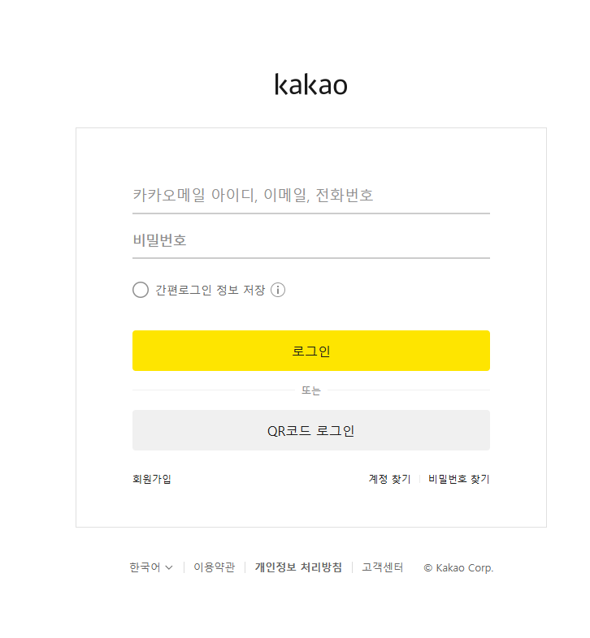
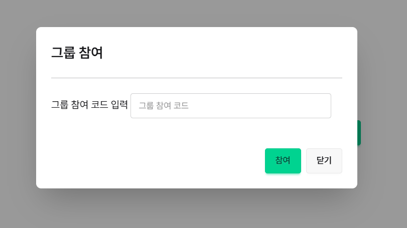
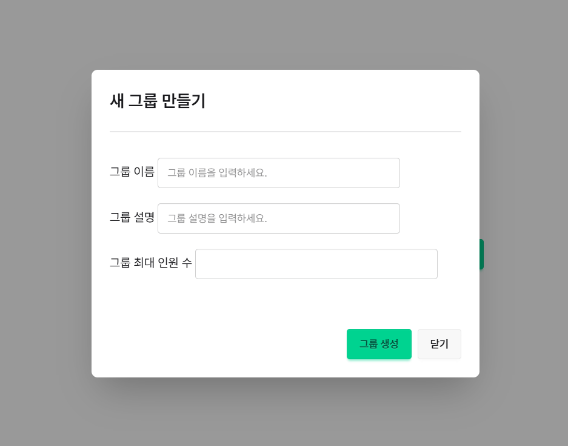
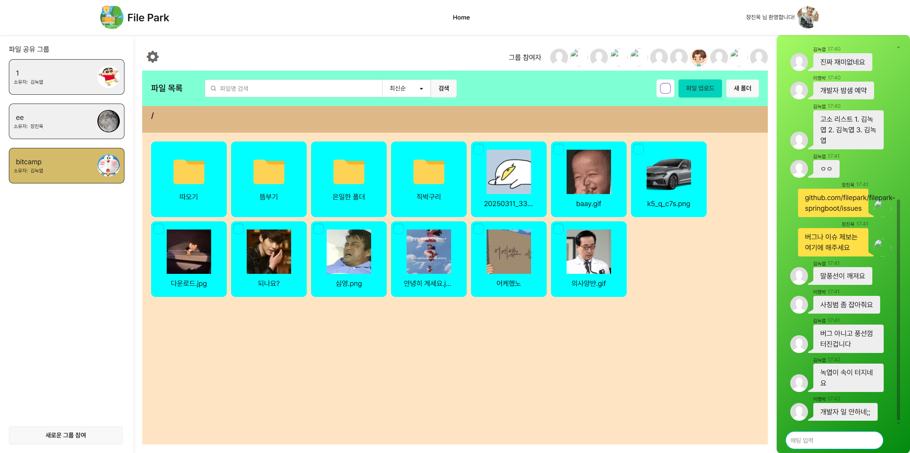
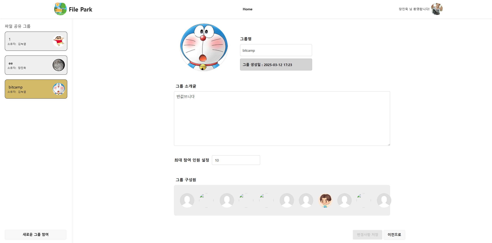
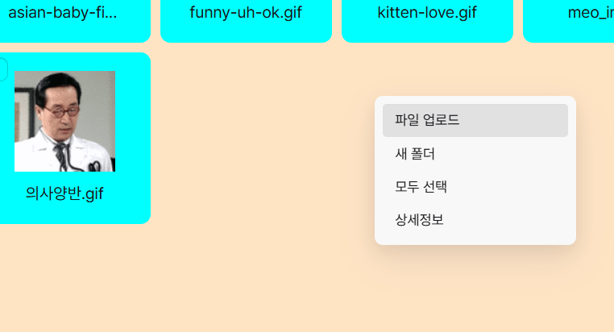
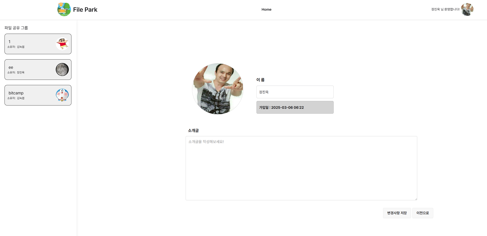
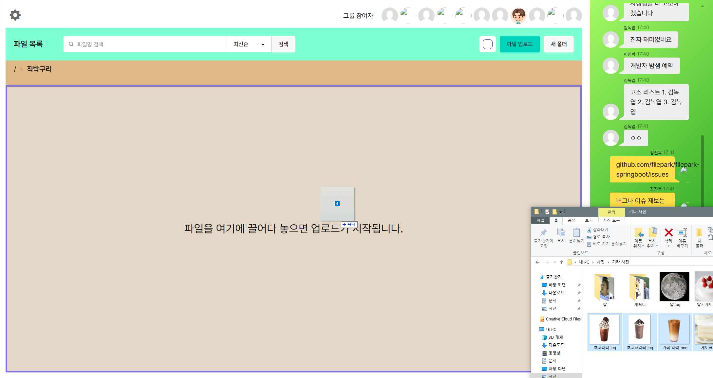

# 2인 프로젝트 - File Park

  

## 📖 프로젝트 소개
> 사진, 동영상 등의 파일을 그룹별로 공유하고 관리할 수 있는 웹 서비스이며, 사용자는 그룹을 생성하거나 참여하여 파일을 업로드하고 관리할 수 있습니다.  
> 또한, 그룹별로 실시간 채팅 기능을 제공하여 사용자 간의 소통을 지원합니다.
- **프로젝트명**: File Park
- **개발 기간**: 2025.03.05 ~ 2025.03.11
- **인원**: **2인 프로젝트 개발**

## 🖥️ 화면 구성
|미리보기|
|:---:|
||

|홈페이지|로그인 페이지|
|:---:|:---:|
|||

|카카오 로그인|네이버 로그인|
|:---:|:---:|
|||

|그룹 참여 모달|그룹 생성 모달|
|:---:|:---:|
|||

|그룹 내에 파일 리스트 조회|그룹 설정|
|:---:|:---:|
|||

|우클릭 메뉴|사용자 프로필|
|:---:|:---:|
|||

|파일 업로드|파일 일괄 업로드|
|:---:|:---:|
|||

## ⚙ 기술 스택
### Framework

### Backend

### Frontend

### Database

### DevOps

 

## 📌 주요 기능
- OAuth2.0 기반 로그인/회원가입(Kakao, Naver)
- 그룹 생성 및 참여 기능
- 그룹별 파일 업로드 및 관리
- 파일 일괄 업로드 및 다운로드 기능
- 파일 및 폴더 일괄 삭제 기능
- 파일 및 폴더 CRUD 기능
- 우클릭 메뉴를 통한 파일 및 폴더 관리
- 사용자 프로필 조회 및 수정
- 그룹별 실시간 채팅 기능
- 그룹 설정 기능 (그룹명, 그룹 설명, 그룹 구성원, 그룹 삭제 등)

## 👥 프로젝트 팀원 및 담당
|이름|역할|
|:---:|:---|
|[장진욱](https://github.com/chauid)|DB 설계, 홈페이지, 그룹 페이지, 파일 및 폴더 CRUD 구현, CI/CD|
|[전종원](https://github.com/jw6963)|사용자 프로필, 그룹별 채팅 기능, OAuth 기반 로그인/회원가입|
